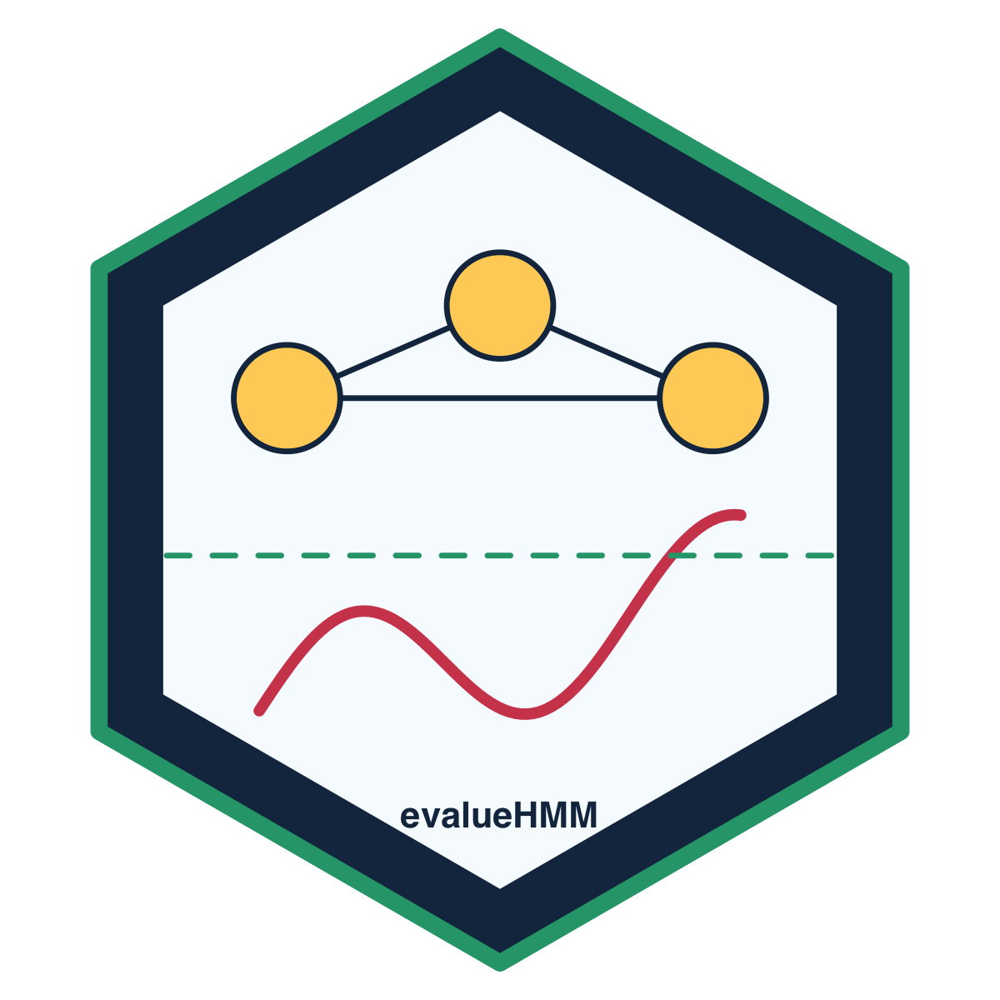

# evalueHMM

[](https://github.com/AurelienNicosiaULaval/predictive_e_diagnostics_hmm/actions/workflows/R-CMD-check.yaml)
[](https://github.com/AurelienNicosiaULaval/predictive_e_diagnostics_hmm/actions/workflows/pkgdown.yaml)
[](https://app.codecov.io/gh/AurelienNicosiaULaval/predictive_e_diagnostics_hmm)
[](https://www.gnu.org/licenses/gpl-3.0)
[](https://lifecycle.r-lib.org/articles/stages.html#experimental)

`evalueHMM` implements predictive e-diagnostics for hidden Markov models of animal movement. It provides tools for observable predictive densities, e-process construction, diagnostic alternatives, predictable mixtures, switching, localization, feature-level diagnostics and blockwise diagnostics.

The repository is both:

1. an installable R package;
2. a reproducible research compendium for the manuscript “Predictive e-diagnostics for multi-state movement models”.

## Installation

Install the development version from GitHub:

```r
install.packages("remotes")
remotes::install_github("AurelienNicosiaULaval/predictive_e_diagnostics_hmm")
```

To clone the research repository with SSH:

```bash
git clone git@github.com:AurelienNicosiaULaval/predictive_e_diagnostics_hmm.git
cd predictive_e_diagnostics_hmm
```

Restore the project environment:

```r
renv::restore()
```

## Quick start

```r
library(evalueHMM)

set.seed(20260522)

null_parameters <- create_hmm_movement_parameters()
validation_data <- simulate_hmm_movement(
  n_times = 150,
  parameters = null_parameters
)

diagnostic_parameters <- perturb_hmm_movement_parameters(
  parameters = null_parameters,
  angle_sd_multiplier = c(1.2, 1.4)
)

log_p0 <- hmm_movement_predictive_log_density(
  data = validation_data,
  parameters = null_parameters
)

log_q <- hmm_movement_predictive_log_density(
  data = validation_data,
  parameters = diagnostic_parameters
)

diagnostic <- make_predictive_diagnostic(
  diagnostic_name = "angle_perturbation",
  log_p0 = log_p0,
  log_q = log_q,
  time = validation_data$time
)

summarise_predictive_diagnostic(diagnostic)
plot_eprocess(compute_eprocess(log_p0, log_q))
```

## Main package features

- HMM filtering and observable predictive log-densities.
- Predictive e-process construction and S3 diagnostic summaries.
- Simulated movement HMM and HSMM-like generators for reproducible examples.
- Full-density diagnostics for state-number and angular misspecification.
- Feature-level diagnostics for residual step-angle dependence.
- Blockwise duration and long-horizon straightness diagnostics.
- Predictable diagnostic mixtures, switching and localization.
- Conservative finite-family composite-null envelopes.

## Vignettes and online documentation

The package includes vignettes for:

- getting started with predictive e-diagnostics;
- using the diagnostic catalog;
- reproducing package checks and manuscript workflows.

Build the local documentation site with:

```r
pkgdown::build_site()
```

When GitHub Pages is enabled, the online site is configured for
`AurelienNicosiaULaval.github.io/predictive_e_diagnostics_hmm`.

## Research compendium

The manuscript-scale simulations and real-data application are intentionally kept outside the package build.

Run all simulation scenarios:

```bash
Rscript simulations/run_all_simulations.R
```

Run the elk application:

```bash
Rscript application/run_application.R
```

Compile the manuscript:

```bash
cd paper
pdflatex predictive_e_diagnostics_hmm_improved.tex
pdflatex predictive_e_diagnostics_hmm_improved.tex
pdflatex supplementary_material.tex
pdflatex supplementary_material.tex
```

Generated research outputs are written to `results/`, `application/data_processed/`, `paper/figures/` and `manuscript_outputs/`.

## Package development

Run the package checks:

```bash
R CMD build --no-build-vignettes .
R CMD check --no-manual --no-build-vignettes evalueHMM_0.1.0.tar.gz
```

Run tests from R:

```r
testthat::test_local()
```

Regenerate documentation:

```r
roxygen2::roxygenise()
```

Regenerate the hex logo:

```bash
Rscript tools/make-logo.R
```

## License

This package is licensed under GPL-3.
