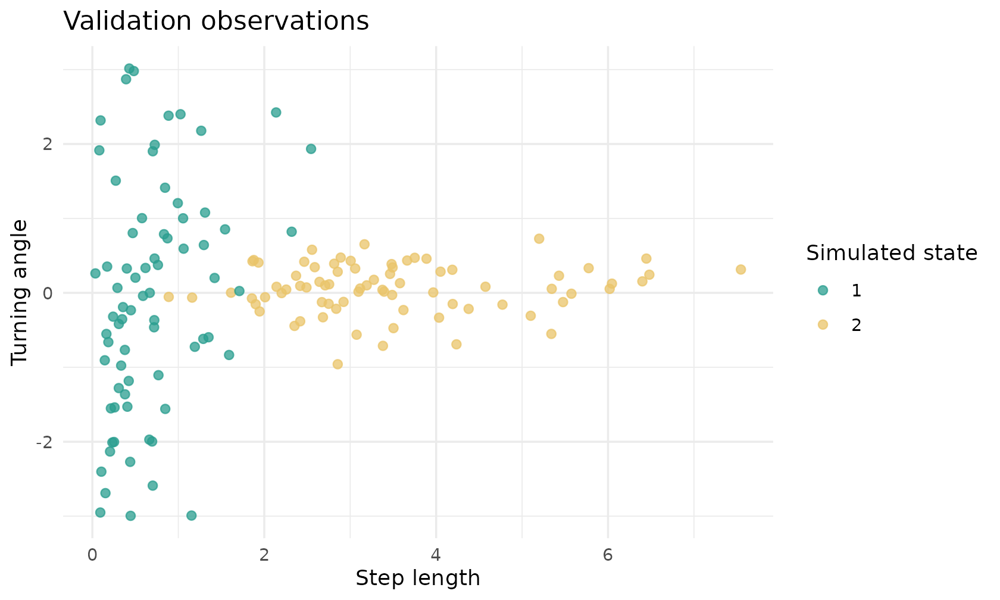
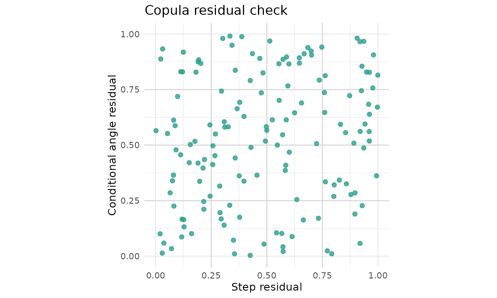
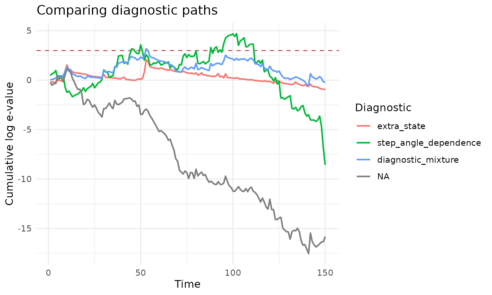
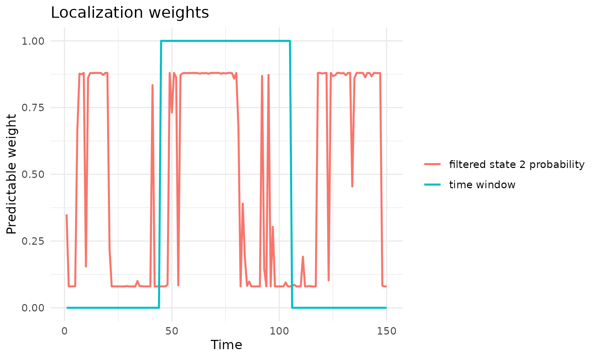
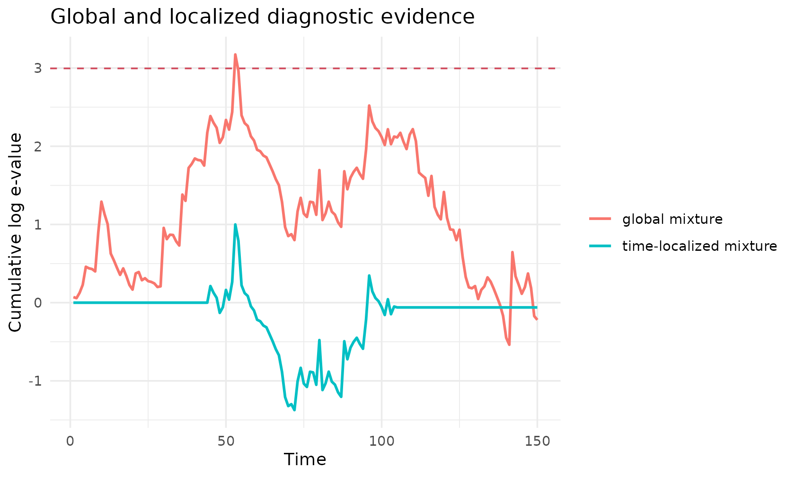

# Diagnostic catalog

``` r

library(evalueHMM)
library(ggplot2)
```

This vignette gives a compact tour of the diagnostic families available
in `evalueHMM`. The examples use a single simulated validation
trajectory so that the diagnostics can be compared on the same time
axis.

The simulated trajectory below has step-angle dependence induced through
a Gaussian copula. The null model is still a standard two-state movement
HMM. This creates a small but visible mismatch for the feature-level
copula diagnostic.

``` r

set.seed(20260522)

null_parameters <- create_hmm_movement_parameters()

validation_data <- simulate_hmm_movement_copula(
  n_times = 150,
  parameters = null_parameters,
  rho_by_state = c(0.55, 0.10)
)

validation_data$state <- factor(validation_data$state)

ggplot(validation_data, aes(x = step_length, y = turning_angle, colour = state)) +
  geom_point(alpha = 0.75, size = 1.8) +
  scale_colour_manual(values = c("#2A9D8F", "#E9C46A", "#264653")) +
  labs(
    x = "Step length",
    y = "Turning angle",
    colour = "Simulated state",
    title = "Validation observations"
  ) +
  theme_minimal()
```



## Full-density diagnostics

Full-density diagnostics replace the null predictive density by another
full movement HMM density. They are useful when the scientific concern
can be expressed as an alternative movement model.

A state-number diagnostic compares the null HMM with a diagnostic HMM
containing one additional state.

``` r

extra_state_parameters <- create_hmm_movement_parameters(
  initial_probs = c(0.55, 0.35, 0.10),
  transition_matrix = matrix(
    c(0.90, 0.08, 0.02,
      0.10, 0.85, 0.05,
      0.12, 0.10, 0.78),
    nrow = 3,
    byrow = TRUE
  ),
  step_shape = c(2, 7, 4),
  step_rate = c(3, 2, 1.5),
  angle_mean = c(0, 0, 0.4),
  angle_sd = c(1.6, 0.35, 0.8)
)

state_diagnostic <- diagnostic_extra_state(
  data = validation_data,
  null_parameters = null_parameters,
  extra_state_parameters = extra_state_parameters
)

summarise_predictive_diagnostic(state_diagnostic)
#>   diagnostic_name alpha threshold signal crossing_time max_log_e final_log_e
#> 1     extra_state  0.05  2.995732  FALSE            NA  2.047781  -0.9408181
#>   mean_log_increment n_observations
#> 1       -0.006272121            150
```

An angular diagnostic keeps the number of states fixed but modifies the
angular component.

``` r

angle_parameters <- perturb_hmm_movement_parameters(
  parameters = null_parameters,
  angle_sd_multiplier = c(1.2, 1.4)
)

angle_diagnostic <- diagnostic_angle(
  data = validation_data,
  null_parameters = null_parameters,
  angle_parameters = angle_parameters
)

summarise_predictive_diagnostic(angle_diagnostic)
#>          diagnostic_name alpha threshold signal crossing_time max_log_e
#> 1 angle_misspecification  0.05  2.995732  FALSE            NA  1.152723
#>   final_log_e mean_log_increment n_observations
#> 1   -15.81742         -0.1054495            150
```

## Feature-level diagnostics

Feature-level diagnostics transform observations through the null model
and then test a lower-dimensional feature. The step-angle diagnostic
uses sequential Rosenblatt residuals and a Gaussian copula diagnostic
density.

``` r

copula_diagnostic <- diagnostic_step_angle_dependence(
  data = validation_data,
  null_parameters = null_parameters,
  rho = 0.45
)

summarise_predictive_diagnostic(copula_diagnostic)
#>         diagnostic_name alpha threshold signal crossing_time max_log_e
#> 1 step_angle_dependence  0.05  2.995732   TRUE            45  4.700148
#>   final_log_e mean_log_increment n_observations
#> 1   -8.573855        -0.05715903            150
head(copula_diagnostic$features)
#>   time individual_id    u_step u_angle_given_step
#> 1    1             1 0.1186335          0.1665613
#> 2    2             1 0.3332687          0.2291244
#> 3    3             1 0.5886906          0.8968392
#> 4    4             1 0.7590032          0.7366286
#> 5    5             1 0.9289046          0.2272643
#> 6    6             1 0.5544554          0.8662198
```

The residual plot is often the most informative visual check. Under a
good null model, the transformed residuals should look roughly
independent and uniform on the unit square. Dependence or structure
suggests a feature-level failure of the null model.

``` r

ggplot(copula_diagnostic$features, aes(x = u_step, y = u_angle_given_step)) +
  geom_hline(yintercept = c(0.25, 0.50, 0.75), colour = "grey85") +
  geom_vline(xintercept = c(0.25, 0.50, 0.75), colour = "grey85") +
  geom_point(alpha = 0.80, size = 1.8, colour = "#2A9D8F") +
  coord_equal(xlim = c(0, 1), ylim = c(0, 1)) +
  labs(
    x = "Step residual",
    y = "Conditional angle residual",
    title = "Copula residual check"
  ) +
  theme_minimal()
```



## Predictable combinations

Diagnostics can be combined by predictable mixture weights. A mixture is
useful when several failure modes are plausible and the analyst wants
one valid diagnostic process rather than a post hoc choice among many
curves.

``` r

mixture <- diagnostic_mixture(
  diagnostics = list(
    extra_state = state_diagnostic,
    angle = angle_diagnostic,
    copula = copula_diagnostic
  ),
  weights = c(1 / 3, 1 / 3, 1 / 3)
)

summarise_predictive_diagnostic(mixture)
#>      diagnostic_name alpha threshold signal crossing_time max_log_e final_log_e
#> 1 diagnostic_mixture  0.05  2.995732   TRUE            53  3.173977  -0.2198431
#>   mean_log_increment n_observations
#> 1       -0.001465621            150
```

The following figure compares the cumulative log e-processes. The dashed
line is the usual `log(1 / alpha)` threshold.

``` r

diagnostic_paths <- rbind(
  state_diagnostic$path,
  angle_diagnostic$path,
  copula_diagnostic$path,
  mixture$path
)

diagnostic_paths$diagnostic_name <- factor(
  diagnostic_paths$diagnostic_name,
  levels = c(
    "extra_state",
    "angle",
    "step_angle_dependence",
    "diagnostic_mixture"
  )
)

ggplot(diagnostic_paths, aes(
  x = time,
  y = log_e_cumulative,
  colour = diagnostic_name
)) +
  geom_hline(
    yintercept = mixture$threshold,
    linetype = "dashed",
    colour = "#D1495B"
  ) +
  geom_line(linewidth = 0.75) +
  labs(
    x = "Time",
    y = "Cumulative log e-value",
    colour = "Diagnostic",
    title = "Comparing diagnostic paths"
  ) +
  theme_minimal()
```



## Localization

A diagnostic can be localized using predictable weights. Here the same
mixture is allowed to accumulate evidence only over a selected time
window.

``` r

window_weights <- time_window_weights(
  time = mixture$path$time,
  start = 45,
  end = 105
)

localized <- localize_predictive_diagnostic(
  diagnostic = mixture,
  weights = window_weights,
  localization_name = "time_window"
)

summarise_predictive_diagnostic(localized)
#>                   diagnostic_name alpha threshold signal crossing_time
#> 1 diagnostic_mixture__time_window  0.05  2.995732  FALSE            NA
#>   max_log_e final_log_e mean_log_increment n_observations
#> 1  1.000124 -0.06076115      -0.0004050743            150
```

State-localized diagnostics can also use filtered predictive state
probabilities. These weights are predictable because they are computed
from past and current information under the null filtering recursion.

``` r

state_weights <- hmm_predictive_state_weights(
  data = validation_data,
  parameters = null_parameters,
  state = 2
)

weights_long <- rbind(
  data.frame(
    time = mixture$path$time,
    weight = window_weights,
    type = "time window"
  ),
  data.frame(
    time = mixture$path$time,
    weight = state_weights,
    type = "filtered state 2 probability"
  )
)

ggplot(weights_long, aes(x = time, y = weight, colour = type)) +
  geom_line(linewidth = 0.8) +
  scale_y_continuous(limits = c(0, 1)) +
  labs(
    x = "Time",
    y = "Predictable weight",
    colour = NULL,
    title = "Localization weights"
  ) +
  theme_minimal()
```



``` r

localized_paths <- rbind(
  data.frame(
    time = mixture$path$time,
    log_e_cumulative = mixture$path$log_e_cumulative,
    process = "global mixture"
  ),
  data.frame(
    time = localized$path$time,
    log_e_cumulative = localized$path$log_e_cumulative,
    process = "time-localized mixture"
  )
)

ggplot(localized_paths, aes(
  x = time,
  y = log_e_cumulative,
  colour = process
)) +
  geom_hline(
    yintercept = mixture$threshold,
    linetype = "dashed",
    colour = "#D1495B"
  ) +
  geom_line(linewidth = 0.8) +
  labs(
    x = "Time",
    y = "Cumulative log e-value",
    colour = NULL,
    title = "Global and localized diagnostic evidence"
  ) +
  theme_minimal()
```



The catalog is meant as a starting point. In an applied analysis, the
diagnostic alternative should be motivated by a concrete modeling
concern such as missing states, poor angular dynamics, residual
step-angle dependence, duration misspecification or localized
habitat-specific failure.
