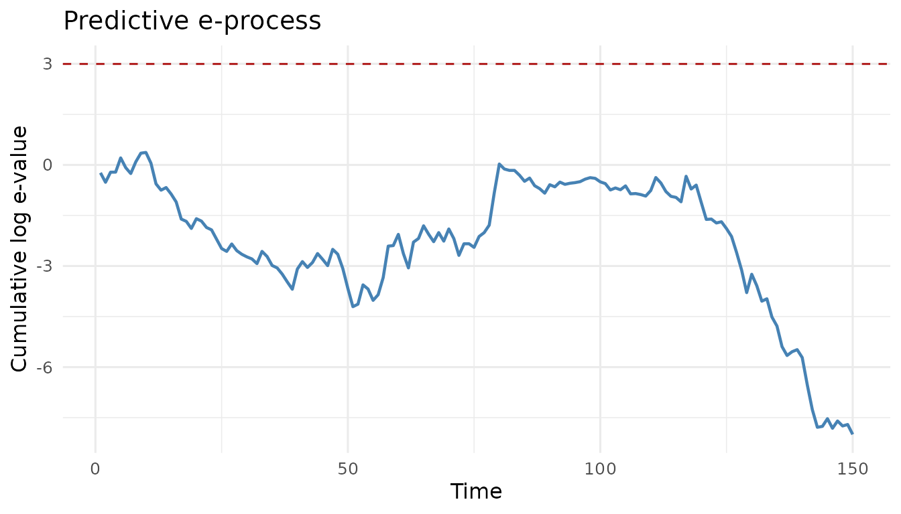

# Getting started with evalueHMM

`evalueHMM` implements predictive e-diagnostics for hidden Markov models
of movement. The basic workflow is:

1.  define a fitted null movement HMM;
2.  define a diagnostic predictive alternative before validation;
3.  compute observable predictive log-densities under both models;
4.  accumulate the log-density ratios as a predictive e-process.

``` r

library(evalueHMM)
```

For a small reproducible example, simulate a trajectory from the
built-in two-state movement HMM.

``` r

set.seed(20260522)

null_parameters <- create_hmm_movement_parameters()
validation_data <- simulate_hmm_movement(
  n_times = 150,
  parameters = null_parameters,
  n_individuals = 1
)

head(validation_data)
#>   individual_id time state step_length turning_angle
#> 1             1    1     1   0.1985733     0.1130060
#> 2             1    2     1   0.0690573     0.3733727
#> 3             1    3     1   0.9531939     2.8549178
#> 4             1    4     1   1.1724559    -0.7645248
#> 5             1    5     2   3.3467476    -0.1729120
#> 6             1    6     2   5.5539626    -0.2006085
```

A diagnostic alternative can be any predictive density fixed before
seeing the validation trajectory. Here we perturb the null parameters
slightly.

``` r

diagnostic_parameters <- perturb_hmm_movement_parameters(
  parameters = null_parameters,
  step_mean_multiplier = c(1.10, 0.95),
  angle_sd_multiplier = c(1.10, 1.20)
)

log_p0 <- hmm_movement_predictive_log_density(
  data = validation_data,
  parameters = null_parameters
)

log_q <- hmm_movement_predictive_log_density(
  data = validation_data,
  parameters = diagnostic_parameters
)
```

The e-process is the cumulative product of the density ratios. On the
log scale, this is a cumulative sum of `log_q - log_p0`.

``` r

eprocess <- compute_eprocess(
  log_p0 = log_p0,
  log_p1 = log_q,
  alpha = 0.05,
  time = validation_data$time
)

summarise_predictive_diagnostic(
  make_predictive_diagnostic(
    diagnostic_name = "perturbed_null",
    log_p0 = log_p0,
    log_q = log_q,
    time = validation_data$time
  )
)
#>   diagnostic_name alpha threshold signal crossing_time max_log_e final_log_e
#> 1  perturbed_null  0.05  2.995732  FALSE            NA  0.370166   -7.996592
#>   mean_log_increment n_observations
#> 1        -0.05331061            150
```

``` r

plot_eprocess(eprocess)
```



The dashed line is `log(1 / alpha)`. Crossing this threshold is evidence
against the fitted null generator in the anytime-valid predictive sense
described in the manuscript.
